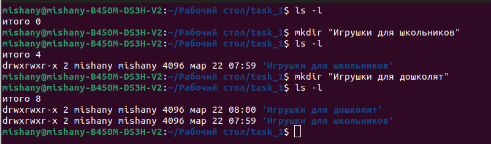
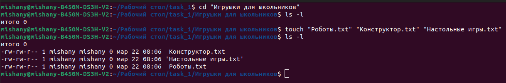
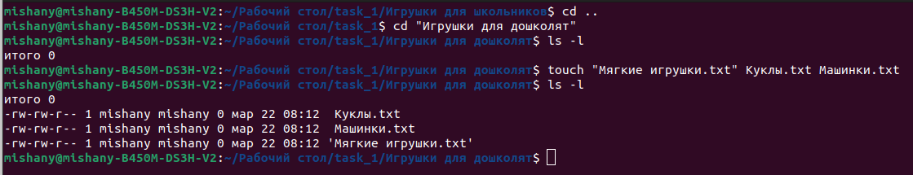
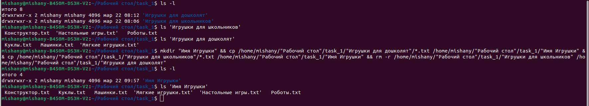
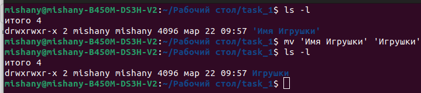
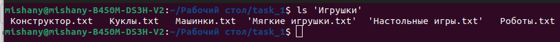
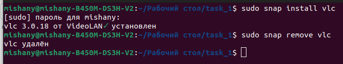
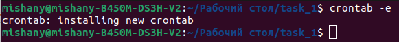
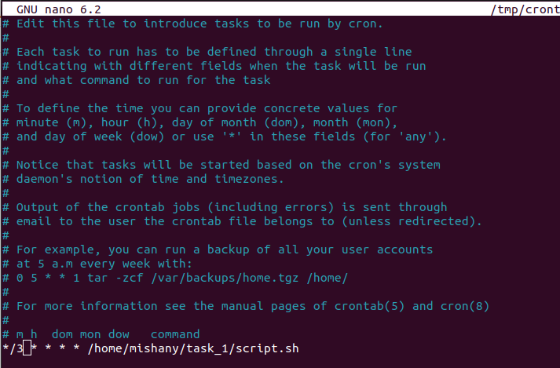
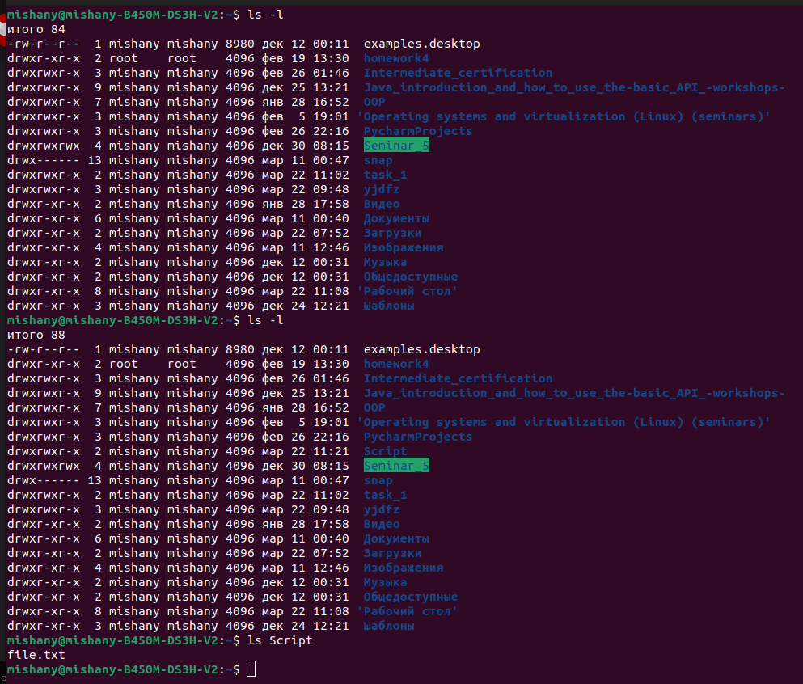

# Промежуточная аттестация
___
___ 

## Задание 1

***

1)   Используйте команды операционной системы Linux и создайте две новых директории – «Игрушки для школьников» и «Игрушки для дошколят»

***
mishany@mishany-B450M-DS3H-V2:~/Рабочий стол/task_1$ ls -l

итого 0

mishany@mishany-B450M-DS3H-V2:~/Рабочий стол/task_1$ mkdir "Игрушки для школьников"

mishany@mishany-B450M-DS3H-V2:~/Рабочий стол/task_1$ ls -l

итого 4

drwxrwxr-x 2 mishany mishany 4096 мар 22 07:59 'Игрушки для школьников'

mishany@mishany-B450M-DS3H-V2:~/Рабочий стол/task_1$ mkdir "Игрушки для дошколят"

mishany@mishany-B450M-DS3H-V2:~/Рабочий стол/task_1$ ls -l

итого 8

drwxrwxr-x 2 mishany mishany 4096 мар 22 08:00 'Игрушки для дошколят'

drwxrwxr-x 2 mishany mishany 4096 мар 22 07:59 'Игрушки для школьников'

mishany@mishany-B450M-DS3H-V2:~/Рабочий стол/task_1$

***

2)   Создайте в директории «Игрушки для школьников» текстовые файлы - «Роботы», «Конструктор», «Настольные игры»
***
mishany@mishany-B450M-DS3H-V2:~/Рабочий стол/task_1$ cd "Игрушки для школьников"

mishany@mishany-B450M-DS3H-V2:~/Рабочий стол/task_1/Игрушки для школьников$ ls -l

итого 0

mishany@mishany-B450M-DS3H-V2:~/Рабочий стол/task_1/Игрушки для школьников$ touch "Роботы.txt" "Конструктор.txt" "Настольные игры.txt"

mishany@mishany-B450M-DS3H-V2:~/Рабочий стол/task_1/Игрушки для школьников$ ls -l

итого 0

-rw-rw-r-- 1 mishany mishany 0 мар 22 08:06  Конструктор.txt

-rw-rw-r-- 1 mishany mishany 0 мар 22 08:06 'Настольные игры.txt'

-rw-rw-r-- 1 mishany mishany 0 мар 22 08:06  Роботы.txt

mishany@mishany-B450M-DS3H-V2:~/Рабочий стол/task_1/Игрушки для школьников$ 

***

3)    Создайте в директории «Игрушки для дошколят» текстовые файлы «Мягкие игрушки», «Куклы», «Машинки»

***
mishany@mishany-B450M-DS3H-V2:~/Рабочий стол/task_1/Игрушки для школьников$ cd ..

mishany@mishany-B450M-DS3H-V2:~/Рабочий стол/task_1$ cd "Игрушки для дошколят"

mishany@mishany-B450M-DS3H-V2:~/Рабочий стол/task_1/Игрушки для дошколят$ ls -l

итого 0

mishany@mishany-B450M-DS3H-V2:~/Рабочий стол/task_1/Игрушки для дошколят$ touch "Мягкие игрушки.txt" Куклы.txt Машинки.txt

mishany@mishany-B450M-DS3H-V2:~/Рабочий стол/task_1/Игрушки для дошколят$ ls -l

итого 0

-rw-rw-r-- 1 mishany mishany 0 мар 22 08:12  Куклы.txt

-rw-rw-r-- 1 mishany mishany 0 мар 22 08:12  Машинки.txt

-rw-rw-r-- 1 mishany mishany 0 мар 22 08:12 'Мягкие игрушки.txt'

mishany@mishany-B450M-DS3H-V2:~/Рабочий стол/task_1/Игрушки для дошколят$ 

***

4)   Объединить 2 директории в одну «Имя Игрушки»

***

mishany@mishany-B450M-DS3H-V2:~/Рабочий стол/task_1$ ls -l

итого 8

drwxrwxr-x 2 mishany mishany 4096 мар 22 08:12 'Игрушки для дошколят'

drwxrwxr-x 2 mishany mishany 4096 мар 22 08:06 'Игрушки для школьников'

mishany@mishany-B450M-DS3H-V2:~/Рабочий стол/task_1$ ls 
'Игрушки для школьников' Конструктор.txt  'Настольные игры.txt'   Роботы.txt

mishany@mishany-B450M-DS3H-V2:~/Рабочий стол/task_1$ ls 
'Игрушки для дошколят' Куклы.txt   Машинки.txt  'Мягкие игрушки.txt'

mishany@mishany-B450M-DS3H-V2:~/Рабочий стол/task_1$ mkdir "Имя Игрушки" && cp /home/mishany/"Рабочий стол"/task_1/"Игрушки для дошколят"/*.txt /home/mishany/"Рабочий стол"/task_1/"Имя Игрушки" && cp /home/mishany/"Рабочий стол"/task_1/"Игрушки для школьников"/*.txt /home/mishany/"Рабочий стол"/task_1/"Имя Игрушки" && rm -r /home/mishany/"Рабочий стол"/task_1/"Игрушки для школьников" /home/mishany/"Рабочий стол"/task_1/"Игрушки для дошколят"

mishany@mishany-B450M-DS3H-V2:~/Рабочий стол/task_1$ ls -l

итого 4

drwxrwxr-x 2 mishany mishany 4096 мар 22 09:57 'Имя Игрушки'

mishany@mishany-B450M-DS3H-V2:~/Рабочий стол/task_1$ ls 'Имя Игрушки' 

Конструктор.txt   Куклы.txt   Машинки.txt  'Мягкие игрушки.txt'  'Настольные игры.txt'   Роботы.txt

mishany@mishany-B450M-DS3H-V2:~/Рабочий стол/task_1$ 

***

5)   Переименовать директорию «Имя Игрушки» в «Игрушки»
***

mishany@mishany-B450M-DS3H-V2:~/Рабочий стол/task_1$ ls -l

итого 4

drwxrwxr-x 2 mishany mishany 4096 мар 22 09:57 'Имя Игрушки'

mishany@mishany-B450M-DS3H-V2:~/Рабочий стол/task_1$ mv 'Имя Игрушки' 'Игрушки'

mishany@mishany-B450M-DS3H-V2:~/Рабочий стол/task_1$ ls -l

итого 4

drwxrwxr-x 2 mishany mishany 4096 мар 22 09:57 Игрушки

mishany@mishany-B450M-DS3H-V2:~/Рабочий стол/task_1$ 

***

6)   Просмотреть содержимое каталога «Игрушки».
***

mishany@mishany-B450M-DS3H-V2:~/Рабочий стол/task_1$ ls 'Игрушки'
 Конструктор.txt   Куклы.txt   Машинки.txt  'Мягкие игрушки.txt'  'Настольные игры.txt'   Роботы.txt

mishany@mishany-B450M-DS3H-V2:~/Рабочий стол/task_1$ 

***

7)   Установить и удалить snap-пакет. (Любой, какой хотите)
***
mishany@mishany-B450M-DS3H-V2:~/Рабочий стол/task_1$ sudo snap install vlc

[sudo] пароль для mishany: 

vlc 3.0.18 от VideoLAN✓ установлен

mishany@mishany-B450M-DS3H-V2:~/Рабочий стол/task_1$ sudo snap remove vlc

vlc удалён

mishany@mishany-B450M-DS3H-V2:~/Рабочий стол/task_1$ 

***

8)   Добавить произвольную задачу для выполнения каждые 3 минуты (Например, запись в текстовый файл чего-то или копирование из каталога А в каталог Б).

***

mishany@mishany-B450M-DS3H-V2:~/Рабочий стол/task_1$ crontab -e

crontab: installing new crontab

mishany@mishany-B450M-DS3H-V2:~/Рабочий стол/task_1$ 

*/3 * * * * /home/mishany/task_1/script.sh

mishany@mishany-B450M-DS3H-V2:~$ ls -l

итого 84

-rw-r--r--  1 mishany mishany 8980 дек 12 00:11  examples.desktop

drwxr-xr-x  2 root    root    4096 фев 19 13:30  homework4

drwxrwxr-x  3 mishany mishany 4096 фев 26 01:46  Intermediate_certification

drwxrwxr-x  9 mishany mishany 4096 дек 25 13:21  Java_introduction_and_how_to_use_the-basic_API_-workshops-

drwxrwxr-x  7 mishany mishany 4096 янв 28 16:52  OOP

drwxrwxr-x  3 mishany mishany 4096 фев  5 19:01 'Operating systems and virtualization (Linux) (seminars)'

drwxrwxr-x  3 mishany mishany 4096 фев 26 22:16  PycharmProjects

drwxrwxrwx  4 mishany mishany 4096 дек 30 08:15  Seminar_5

drwx------ 13 mishany mishany 4096 мар 11 00:47  snap

drwxrwxr-x  2 mishany mishany 4096 мар 22 11:02  task_1

drwxrwxr-x  3 mishany mishany 4096 мар 22 09:48  yjdfz

drwxr-xr-x  2 mishany mishany 4096 янв 28 17:58  Видео

drwxr-xr-x  6 mishany mishany 4096 мар 11 00:40  Документы

drwxr-xr-x  2 mishany mishany 4096 мар 22 07:52  Загрузки

drwxr-xr-x  4 mishany mishany 4096 мар 11 12:46  Изображения

drwxr-xr-x  2 mishany mishany 4096 дек 12 00:31  Музыка

drwxr-xr-x  2 mishany mishany 4096 дек 12 00:31  Общедоступные

drwxr-xr-x  8 mishany mishany 4096 мар 22 11:08 'Рабочий стол'

drwxr-xr-x  3 mishany mishany 4096 дек 24 12:21  Шаблоны

mishany@mishany-B450M-DS3H-V2:~$ ls -l

итого 88

-rw-r--r--  1 mishany mishany 8980 дек 12 00:11  examples.desktop

drwxr-xr-x  2 root    root    4096 фев 19 13:30  homework4

drwxrwxr-x  3 mishany mishany 4096 фев 26 01:46  Intermediate_certification

drwxrwxr-x  9 mishany mishany 4096 дек 25 13:21  Java_introduction_and_how_to_use_the-basic_API_-workshops-

drwxrwxr-x  7 mishany mishany 4096 янв 28 16:52  OOP

drwxrwxr-x  3 mishany mishany 4096 фев  5 19:01 'Operating systems and virtualization (Linux) (seminars)'

drwxrwxr-x  3 mishany mishany 4096 фев 26 22:16  PycharmProjects

drwxrwxr-x  2 mishany mishany 4096 мар 22 11:21  **Script**

drwxrwxrwx  4 mishany mishany 4096 дек 30 08:15  Seminar_5

drwx------ 13 mishany mishany 4096 мар 11 00:47  snap

drwxrwxr-x  2 mishany mishany 4096 мар 22 11:02  task_1

drwxrwxr-x  3 mishany mishany 4096 мар 22 09:48  yjdfz

drwxr-xr-x  2 mishany mishany 4096 янв 28 17:58  Видео

drwxr-xr-x  6 mishany mishany 4096 мар 11 00:40  Документы

drwxr-xr-x  2 mishany mishany 4096 мар 22 07:52  Загрузки

drwxr-xr-x  4 mishany mishany 4096 мар 11 12:46  Изображения

drwxr-xr-x  2 mishany mishany 4096 дек 12 00:31  Музыка

drwxr-xr-x  2 mishany mishany 4096 дек 12 00:31  Общедоступные

drwxr-xr-x  8 mishany mishany 4096 мар 22 11:08 'Рабочий стол'

drwxr-xr-x  3 mishany mishany 4096 дек 24 12:21  Шаблоны

mishany@mishany-B450M-DS3H-V2:~$ ls Script

**file.txt**

mishany@mishany-B450M-DS3H-V2:~$ 

***